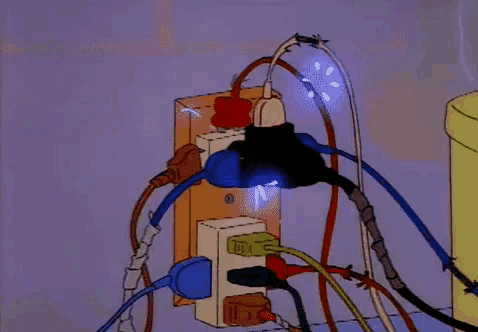

# ⚡ 🧮 Calculadora de Consumo Elétrico Inteligente 🧮 ⚡

  

## 🎯 Objetivo
Sistema criado para ajudar a estimar o consumo mensal de energia elétrica de um aparelho doméstico, incluindo uma projeção de custo em reais 💸

## 💻 Tecnologia 
Desenvolvido em **Python**.

## ➗ Fórmula Utilizada
Para chegar ao consumo mensal em kWh, o sistema aplica a seguinte fórmula matemática:
`consumoMensal = (potencia * horasDia * 30) / 1000`

## 🚀 Como executar o programa
1. Certifique-se de ter o Python instalado na máquina.
2. Clone este repositório ou faça o download dos arquivos.
3. Abra o terminal na pasta do projeto e execute o comando:
`python app.py`
4. Siga as instruções na tela para inserir os dados.